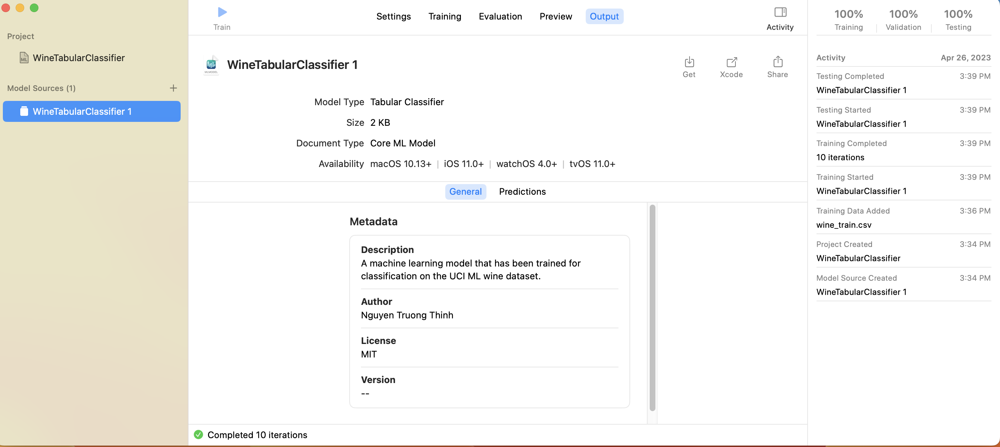
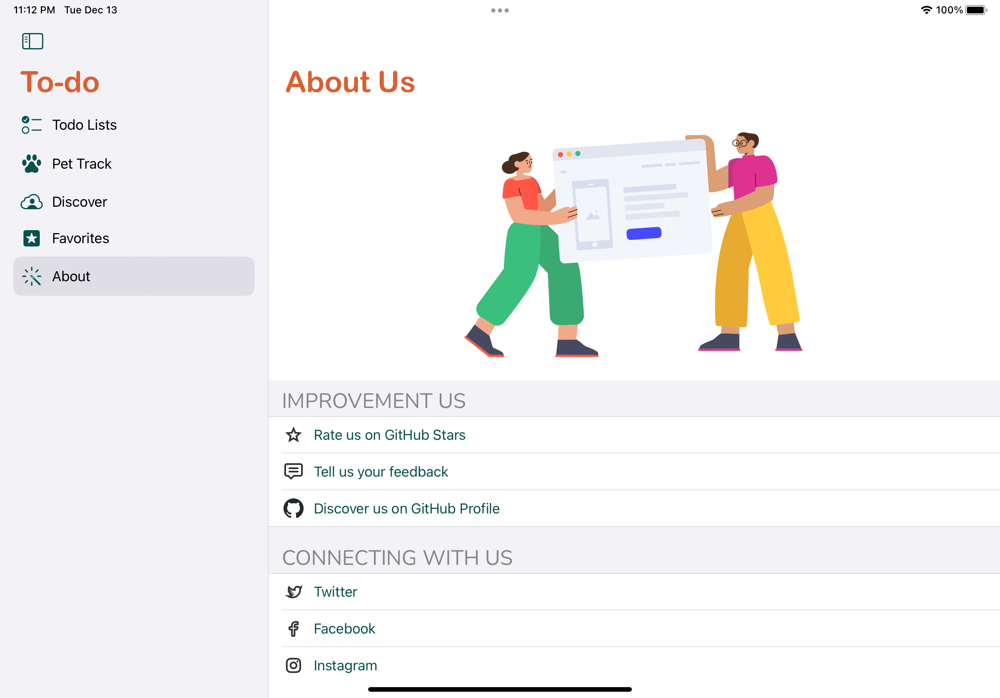

# <>To be an Apple Platforms Developer</>
___
## Introduction
**The self-taught projects** 
<em>I follow the latest trends & technology in the market. I make sure my code is of production quality.<em> 

<strong>Special thanks to `the countless researchers` and `developers` around the world and their open-source code, particularly Swift/ Objective-C-based open-source code!<strong>
___

## #3: CreateML Apps
### #2: UCI ML repository's Wine - A Tabular Classification with the Create ML app.
  

### #1: Kaggle Dogs vs. Cats - An Image Classifier with the Create ML app.
  

## #2: Todo - A cross-platform (iOS - iPadOS - macOS) app.
- This is a cross-platform application in SwiftUI. 
- We create an iOS app and reuse some of its components to create an iPad, macOS app.

### Conveniences: 

- The To-do list tab screen & Add new todo item sheet:
  

- The Pet Track list tab screen:
  

- The Github’s Users search tab screen:
  

- The favorite github’s users tab screen:
  

- Expecially, integreting and consuming a TutorialAbout swift package for the about us tab screen:
  

- For more details, see: [README](https://github.com/DevOpsThinh/iOS-with-UIKit-SwiftUI/blob/master/README.md)
___
## #1: MarkdownEditor - like TextEdit, Pages, Numbers apps.
- This is a document-based app/ purely macOS application. 
- The app allows users to: write formatted text quickly and easily. And it can be converted into HTML for displaying but is much more convenient to write and edit,  with: The HTML preview, a toolbar, menus, and allow app to use either ".md/ .markdown/ .mdown" for the file extensions. 
- Currently, the application supports 2 languages: English and Vietnamese. 
  

### Conveniences: 

- The HTML preview and a Settings window for the ability to change the editor font size:
  

- A Cheatsheet menu item within an Help existing menu:
  

- A completely new menu - StyleSheet for change to a different stylesheet:
  

- A Toolbar: controls to switch between three preview models: web, HTML, off - hidden.
  

- Expecially, on macOS 12 or above, using AttributedString that could be formatted using Markdown and make the text inside Text views selectable.
___
## Improve us :handshake:
<strong><em>:star: Please give me a STAR! :star:<em><strong>
___
## References

- [Swift-MarkdownKit](https://github.com/objecthub/swift-markdownkit) for coverting Markdown to HTML
- [Markdown Here](https://github.com/adam-p/markdown-here)
- [.MARKDOWN File Extension](https://fileinfo.com/extension/markdown)
- [Daring Fireball - Markdown](https://daringfireball.net/projects/markdown/)

